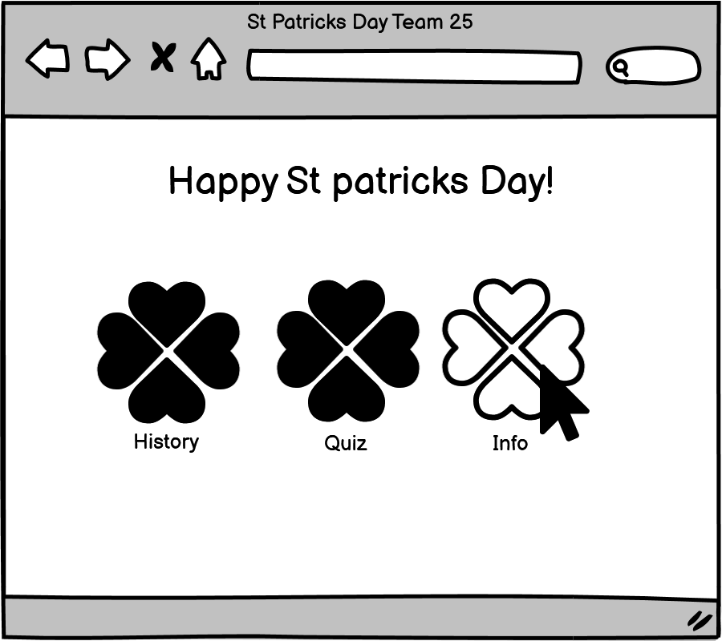
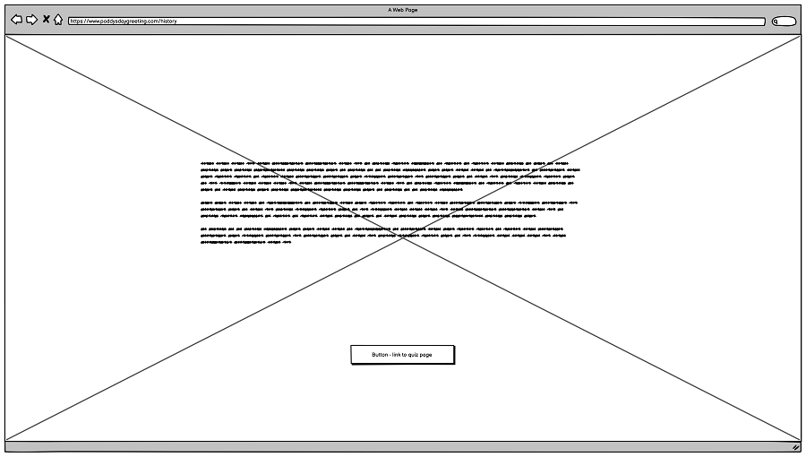
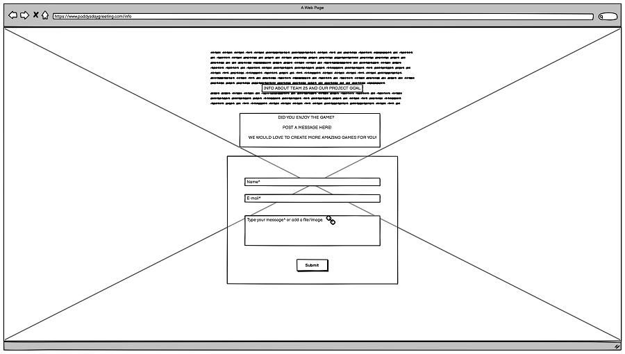
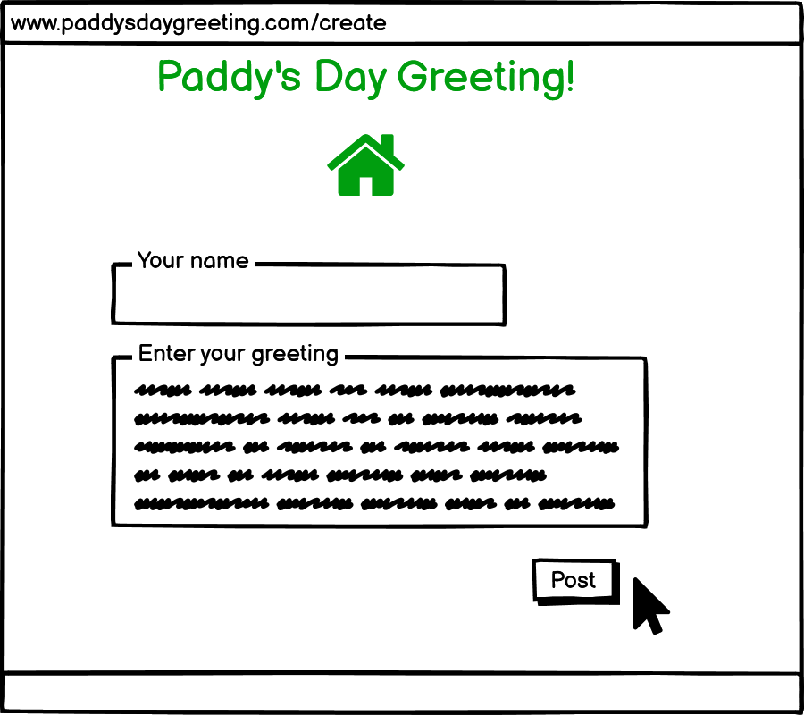

# Paddy's day greeting

The goal of this project is to remind users of the history and tradition of Saint Patrick's day and at the same time positively reinforce their learning with a quiz. Our goal as a team is to learn how to collaborate as a group in a common project. The aim of this project is also to be contacted by users and developers to have their feedback or the request to develop a create a site for them.

## UX

The ideal user of our website is:

- An English or Gaelic speaking person.

###This website is:
- Easy to browse.
- The informations provided are simple and displayed in a fun way.
- Guide the users to play a quiz and to get in touch with the Team 25.

### User Stories

- As a new visitor of the website, I want to learn more about the history and tradition of Saint Patrick day.
- As a new visitor of the website, I want to challenge my knowledge about why we celebrate the 17th of March.
- As a new visitor of the website, I want to positively reinforce my learning and have fun.
- As a new visitor of the website, I want to get in touch with Team 25 and make get in touch for collaboration.
- As a returning visitor of the website, I want to ask to Team 25 for more projects to collaborate on.

##### Wireframe mockups:

- 
Here we see a mockup of the homepage. The user is presented with three shamrocks. These shamrocks will respond to the user hovering over them. Clicking the shamrocks will navigate the user to the various pages on the site.

- 
An early mockup of the history page. Here, the user can learn some facts about the St Patricks Day celebrations.

- 
The about page allows the user to make contact with the sites developers.

- 
Here we see a mockup of the greeting generator. The user will click a button which will then display a random Irish greeting.

- 

[Wireframe image](assets/img/wireframe.png) 

## Features
* The main menu allows the users to navigate to the various sections of the site. The menu is positioned central in the page where a Three-leaf cloves indicates the different pages. 
* On each of the history and about us pages there is also a drop down menu which allows users to go back
to the home page or any other page from these pages.  It is not needed on the quiz page as the exit quiz
button takes a user back to the home page.  A user can also click on the rainbow icon from the quiz page
and be taken back to the home page.
* The header Logo exists on [every page](../index.html) on the top-left and allows users to come back to the home page as they would expect.
* The greeting generator allows users to leave their greetings. Each time the page loads a different greet is displayed.
* The quiz game allows the users to challenge themselves and gives them a final score.
* The about section provides information about Team 25.
* A contact form allows users to get in touch with the Team 25 and make their request.
* A toggle menu is present on history and about pages to facilitate user experience otherwise they always had to go back to the home page.

## Surface 
### colors: we used green color for call to action-buttons.
The images, logo and clipart adhere to the theme of Saint Patrick day.
### Icons and images are related to Ireland and Saint Patrick day tradition.
### Google Fonts:
- body: 'Josefin Sans', sans-serif.
- headings: 'Irish Grover', cursive.
- subheading: 'Indie Flower', cursive.

### Features Left to Implement
- The initial idea was to create a backend website with Django.
- One feature that django enable us to implement were a database for user comments.
- Another feature that could be implemented with django is a gallery for users to add their own pictures to.
- A login and authentication system could be implemented for users.

## Technologies Used

- This project uses HTML, CSS and Javascript programming languages.
- [BootstrapCDN](https://www.bootstrapcdn.com/) to simplify the structure of the website and make the website responsive.
- [Google Fonts](https://fonts.google.com/) to style the website fonts.
- [AutoPrefixer](https://autoprefixer.github.io/) make sure the css code is valid for all browsers.
- [EmailJS](https://www.emailjs.com/docs/sdk/installation/) to add functionality to our contact form.

## Testing

We have checked the validity of the code with: 
- [W3C CSS Validation Service](https://jigsaw.w3.org/css-validator/)
- [W3C Markup Validation Service](https://validator.w3.org/)

We tested the user stories manually. 

1. About us form:
    1. Go to the "About us" page
    2. Try to submit the empty form and verify that an error message about the required fields appears
    3. Try to submit the form with an invalid email address and verify that a relevant error message appears
    4. Try to submit the form with all inputs valid and verify that a success message appears
    5. Try to test it and I received an email in my email box 

2. Quiz game behaves as expected and returns a final score.
3. The greeting function has been tested and works accordingly  

Our project looks responsive on different browsers and screen sizes.

## Deployment

We deployed the project to a hosting platform (GitHub Pages).
At the moment of submitting this project the Development Branch and Master Branch are identical. 

- We used different editors: Gitpod and VS Code.
- We used separated git branches.
- We used the following commands: **git checkout -b new_branch_name** (this created a new branch with the name we choose(ex. marta, debbie, history etc.) **git pull upstream master** (this updated our current branch to be in sync with the latest version of the master branch)
**git branch -a** (this showed us a list of all the branches currently in development and the one that we were currently editing was highlighted with an asterisk) **git checkout branch_name** (This command will switch your development to the branch you choose)
**git branch -u origin/name of the branch** (this set the branch we were currently checked out in to track the remote branch)
**git push** (this push all the changes to the remote repo)

Reading and troubleshooting on cloning a repository from GitHub [Article](https://help.github.com/en/articles/cloning-a-repository).
Reading about how to create git branches [Git branches](https://learngitbranching.js.org).

## Credits

### Content
- The text for the Home page was created by Arland.
- The greetings were created by Andrew.
- The text for history page was written by Marta and extracted from [Wikipedia](https://en.wikipedia.org/wiki/Saint_Patrick%27s_Day)
- The questions for the quiz were written by Debbie and extracted from [we love quizzes](https://www.welovequizzes.com/st-patricks-day-quiz-questions-and-answers/) and the quiz was based on an idea presented by [codingNepal](https://www.codingnepalweb.com/)

### Media

- The background image for history page [Needpix](https://www.needpix.com/photo/download/1861386/storytelling-story-telling-tale-storyteller-fantasy-imagination-literature-kids)
- The logo is from [Free Logo Maker](https://logomakr.com/6FZRHv)
- Icons made by Freepik from [www.flaticon.com](https://www.flaticon.com/)

### Acknowledgements
- We would like to thank our tutor Tim Nelson for his precious advice.

**_NOTE:_** This is for educational purposes.